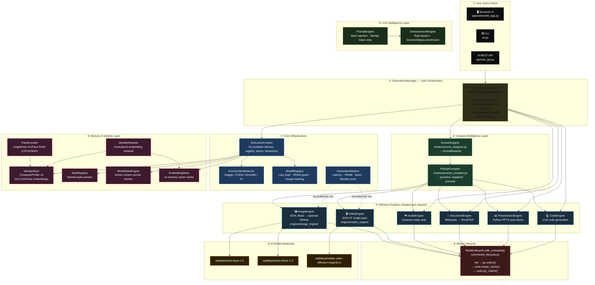
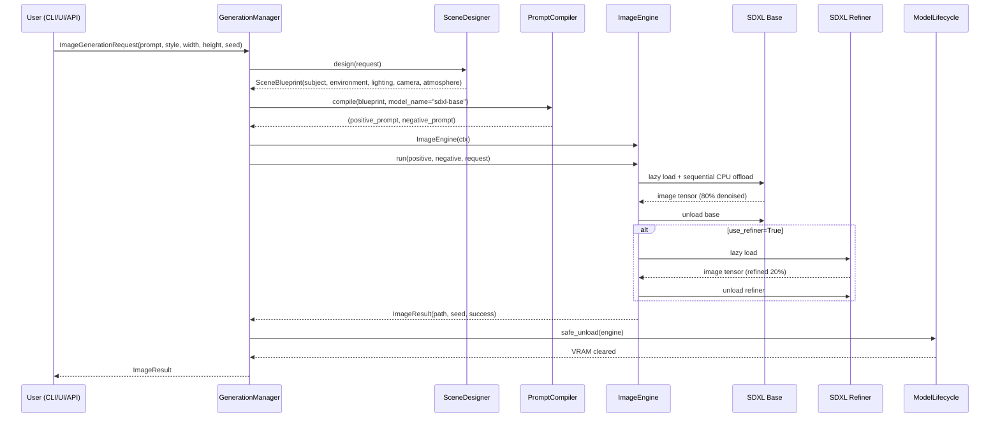
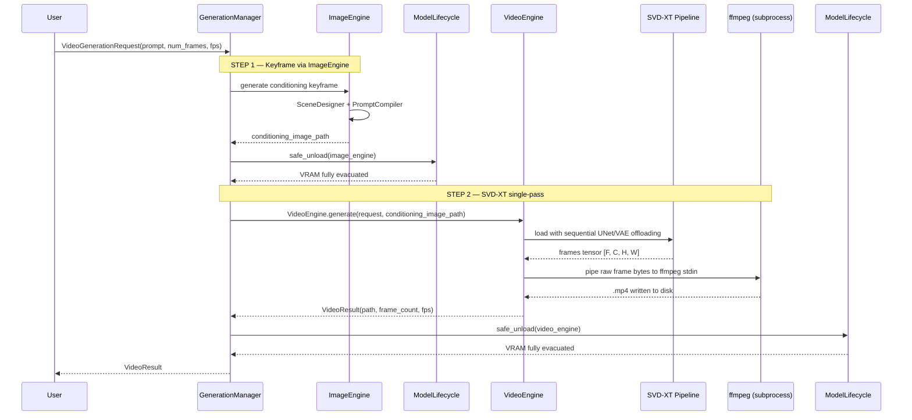
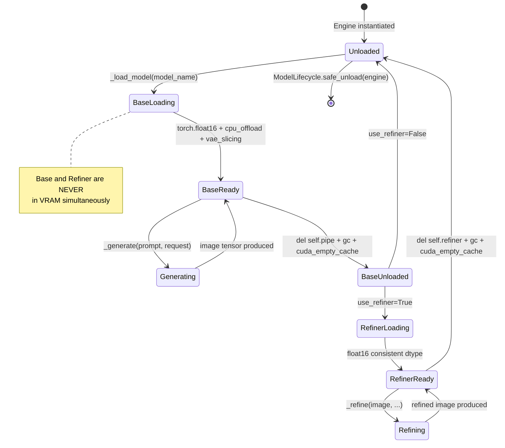

# 🎬 MultiGenAI OS (MGOS)

> **A modular, multi-modal AI content generation operating system** — generate photorealistic images, videos, audio, documents, code, and presentations from a single natural language prompt. Built on SDXL, SVD-XT, and a pluggable creative intelligence layer.

[](https://python.org)
[](https://github.com/huggingface/diffusers)
[](#running-tests)
[](#license)

---

## Table of Contents

1. [What is MultiGenAI OS?](#what-is-multigenai-os)
2. [Key Features](#key-features)
3. [System Architecture](#system-architecture)
4. [Project Structure](#project-structure)
5. [Module Reference](#module-reference)
   - [Core Layer](#core-layer)
   - [Creative Layer](#creative-layer) ✨ *New in Phase 7*
   - [LLM Intelligence Layer](#llm-intelligence-layer)
   - [Memory Layer](#memory-layer)
   - [Identity Layer](#identity-layer)
   - [Engines Layer](#engines-layer)
   - [Control Layer](#control-layer)
   - [Temporal Layer](#temporal-layer)
   - [Orchestration Layer](#orchestration-layer)
   - [API & UI Layer](#api--ui-layer)
6. [Generation Pipeline](#generation-pipeline)
7. [Adaptive Behaviour Matrix](#adaptive-behaviour-matrix)
8. [Configuration Reference](#configuration-reference)
9. [Environment Variables](#environment-variables)
10. [Installation](#installation)
11. [Running the Application](#running-the-application)
12. [Running Tests](#running-tests)
13. [Roadmap & Phases](#roadmap--phases)

---

## What is MultiGenAI OS?

MultiGenAI OS is a **production-grade, multi-modal content generation system** designed to run everywhere — from a local developer machine (CPU or GPU) to a Kaggle notebook with a T4/P100/V100. It provides a unified interface to generate:

| Modality | Engine | Backend |
|---|---|---|
| 🖼️ **Images** | `ImageEngine` | SDXL Base + optional Refiner (two-stage) |
| 🎬 **Videos** | `VideoEngine` | Stable Video Diffusion XT (SVD-XT) |
| 🔊 **Audio** | `AudioEngine` | Schema ready; implementation planned |
| 📄 **Documents** | `DocumentEngine` | Wikipedia-sourced Word/PDF reports |
| 📊 **Presentations** | `PresentationEngine` | Python-PPTX auto-decks |
| 💻 **Code** | `CodeEngine` | LLM-guided code file generation |

The system auto-detects its execution environment (Kaggle, local GPU, CPU) and adapts resolution, frame count, and memory management accordingly — **no manual tuning required**.

Every generation request flows through:
```
Intent → SceneDesigner → PromptCompiler → Isolated Engine → ModelLifecycle.safe_unload → Output
```

---

## Key Features

- **🎨 Creative Intelligence Layer (Phase 7)** — `SceneDesigner` converts raw intent into a structured `SceneBlueprint`; `PromptCompiler` turns that into optimized diffusion prompts with model-specific negative tokens
- **🔒 Strict Model Lifecycle** — `ModelLifecycle.safe_unload()` ensures VRAM is fully evacuated after every generation; base and refiner are NEVER loaded simultaneously
- **🎬 SVD-XT Video Generation (Phase 6)** — Single-pass Stable Video Diffusion XT pipeline with sequentially-offloaded UNet; `ffmpeg` direct byte-pipe encoding produces `.mp4` without intermediate disk writes
- **🤖 GenerationManager Orchestration** — All modalities flow through a single orchestrator; engines are instantiated, run, and destroyed per-request — no engine shares state with another
- **🧠 Dual LLM Mode** — LLM-enhanced prompts (Gemini/OpenAI/Ollama) with automatic rule-based fallback; zero config required for offline use
- **👤 Persistent Character Identity** — 512-d ArcFace face embeddings via InsightFace, stored persistently and injected for frame-consistent characters
- **🌍 Adaptive Execution** — Auto-detects Kaggle, GPU VRAM tier, DirectML (AMD on Windows), and CI environments
- **📊 Generation Metrics** — Per-run structured metrics (latency, VRAM usage, seed) stored as JSON
- **🖥️ Streamlit UI** — Full browser-based UI with modality selector and real-time capability report
- **✅ 199 Tests Passing** — Comprehensive test coverage across all modules without requiring GPU or network

---

## System Architecture

MGOS is structured around **three core architectural principles**:

| Principle | Implementation |
|---|---|
| **No engine calls another engine** | All cross-engine orchestration is `GenerationManager`'s sole responsibility |
| **Every model is isolated in VRAM** | Engines load lazily and `ModelLifecycle.safe_unload()` is called in every `finally` block |
| **Intent precedes inference** | `SceneDesigner → PromptCompiler` always runs before any GPU operation begins |

---

### L1 — System Overview



---

### L2 — Image Generation Data Flow



---

### L2 — Video Generation Data Flow



---

### L2 — VRAM Lifecycle State Machine



---

### Architectural Layer Summary

| # | Layer | Location | Responsibility |
|---|---|---|---|
| ① | **Entry Points** | `cli.py`, `api/`, `apps/` | Accept user input; delegate 100% to GenerationManager |
| ② | **GenerationManager** | `core/generation_manager.py` | Sole orchestrator; owns inter-engine sequencing; enforces lifecycle |
| ③ | **Creative Layer** | `creative/` | Converts intent into `SceneBlueprint` → optimized prompts before any GPU op |
| ④ | **LLM Intelligence** | `llm/` | Style injection, token stripping, LLM-based enhancement |
| ⑤ | **Engines** | `engines/` | Isolated inference; each engine owns its model load/unload; no engine calls another |
| ⑥ | **Model Lifecycle** | `core/model_lifecycle.py` | Centralized teardown (`del`, `gc`, `empty_cache`, `ipc_collect`) |
| ⑦ | **Core Infrastructure** | `core/` | Settings, DI container, device detection, metrics, exception hierarchy |
| ⑧ | **Memory & Identity** | `memory/`, `identity/` | Persistent character embeddings, style presets, world state, embedding cache |
| ⑨ | **AI Backends** | HuggingFace Hub | SDXL Base, SDXL Refiner, SVD-XT (downloaded on first use) |

---

## Project Structure

```
multigen/
├── apps/
│   └── streamlit_app.py              # Streamlit browser UI
├── multigenai/
│   ├── cli.py                        # CLI entry point (routes through GenerationManager)
│   ├── core/
│   │   ├── config/
│   │   │   ├── settings.py           # Settings dataclasses + loader
│   │   │   └── config.yaml           # Default configuration
│   │   ├── logging/                  # Structured logger (pretty/JSON)
│   │   ├── capability_report.py      # System capability snapshot
│   │   ├── device_manager.py         # CUDA/DirectML/CPU device abstraction
│   │   ├── environment.py            # Platform detection + BehaviourProfile
│   │   ├── exceptions.py             # Custom exception hierarchy
│   │   ├── execution_context.py      # DI container wired at startup
│   │   ├── generation_manager.py     # ✨ Sole orchestrator for all modalities
│   │   ├── lifecycle.py              # Startup/shutdown lifecycle manager
│   │   ├── metrics.py                # GenerationMetrics recording
│   │   ├── model_lifecycle.py        # ✨ ModelLifecycle.safe_unload() helper
│   │   └── model_registry.py         # Lazy model loader + VRAM guard
│   ├── creative/                     # ✨ Phase 7 Creative Intelligence Layer
│   │   ├── scene_designer.py         # Intent → SceneBlueprint
│   │   └── prompt_compiler.py        # SceneBlueprint → optimized prompts
│   ├── llm/
│   │   ├── providers/
│   │   │   ├── base.py               # LLMProvider abstract base
│   │   │   ├── local_provider.py     # Ollama integration
│   │   │   └── api_provider.py       # Gemini / OpenAI API integration
│   │   ├── enhancement_engine.py     # Rule-based + LLM prompt enricher
│   │   ├── prompt_engine.py          # Full prompt processing pipeline
│   │   ├── scene_planner.py          # Multi-scene narrative planner
│   │   └── schema_validator.py       # Pydantic v2 request/response schemas
│   ├── memory/
│   │   ├── embedding_store.py        # In-memory vector embedding cache
│   │   ├── identity_store.py         # Persistent character identity (v3 schema)
│   │   ├── style_registry.py         # Named style presets
│   │   └── world_state.py            # Scene/world state engine
│   ├── identity/
│   │   ├── face_encoder.py           # ArcFace 512-d via InsightFace (CPU-only)
│   │   └── identity_resolver.py      # Centralized embedding retrieval
│   ├── engines/
│   │   ├── image_engine/             # ✨ Phase 7: SDXL strict lifecycle engine
│   │   ├── video_engine/             # ✨ Phase 6: SVD-XT single-pass pipeline
│   │   ├── audio_engine/             # Schema-ready stub
│   │   ├── document_engine/          # Word/PDF reports
│   │   ├── presentation_engine/      # PowerPoint decks
│   │   └── code_engine/              # LLM code generation
│   ├── control/
│   │   ├── consistency_enforcer.py   # Identity drift detection (cosine sim)
│   │   ├── controlnet_manager.py     # ControlNet integration manager
│   │   └── guidance_manager.py       # CFG control
│   ├── temporal/
│   │   ├── latent_propagator.py      # Latent noise propagation between frames
│   │   ├── motion_engine.py          # Motion field computation
│   │   └── optical_flow.py           # Optical flow estimation
│   ├── orchestration/
│   │   ├── dag_engine.py             # DAG-based multi-step job execution
│   │   ├── job_queue.py              # Async job queue
│   │   └── task_scheduler.py         # Task scheduling
│   └── api/
│       ├── rest_api.py               # FastAPI REST endpoints
│       └── websocket.py              # WebSocket streaming
├── tests/
│   ├── test_phase1.py                # 70 core infrastructure tests
│   ├── test_environment.py           # Environment detection + Phase 7 schema tests
│   ├── test_identity.py              # 50 identity layer tests
│   ├── test_llm_providers.py         # LLM provider tests
│   └── test_compute_stability.py     # Metrics, registry, Phase 7 lifecycle tests
├── requirements.txt
└── pyproject.toml
```

---

## Module Reference

### Core Layer

#### `GenerationManager` (`core/generation_manager.py`) ✨ New in Phase 7

The **sole orchestrator** for all generation modalities. All CLI, API, and UI requests route through here.

- Instantiates each engine per-request, never shares engines between requests
- Calls `SceneDesigner → PromptCompiler` before any diffusion call
- Calls `ModelLifecycle.safe_unload()` in every `finally` block
- Video generation: `ImageEngine` (keyframe) → unload → `VideoEngine` (SVD-XT) → unload

```python
from multigenai.core.generation_manager import GenerationManager
from multigenai.llm.schema_validator import ImageGenerationRequest

manager = GenerationManager(ctx)
result = manager.generate_image(ImageGenerationRequest(
    prompt="a knight at dawn",
    style="cinematic",
    use_refiner=True,
))
```

#### `ModelLifecycle` (`core/model_lifecycle.py`) ✨ New in Phase 7

Centralized GPU memory teardown. Replaces all scattered `del`, `gc.collect()`, `empty_cache()` patterns.

```python
from multigenai.core.model_lifecycle import ModelLifecycle

ModelLifecycle.safe_unload(engine)  # handles None, del, gc, cuda cache — all in one call
```

#### `ExecutionContext` (`core/execution_context.py`)

The single dependency container passed to every engine. Created once at startup.

| Attribute | Type | Description |
|---|---|---|
| `settings` | `Settings` | Loaded application settings |
| `device` | `str` | Active device: `"cuda"` / `"directml"` / `"cpu"` |
| `behaviour` | `BehaviourProfile` | Adaptive limits (max_res, auto_unload, etc.) |
| `registry` | `ModelRegistry` | Lazy-loading model registry |
| `identity_store` | `IdentityStore` | Persistent character identity store |
| `style_registry` | `StyleRegistry` | Named style presets |
| `environment` | `EnvironmentProfile` | Detected platform/VRAM snapshot |

#### `EnvironmentDetector` (`core/environment.py`)

Runs at startup. Detects Kaggle, CUDA, DirectML, CI environments; queries VRAM; produces an immutable `EnvironmentProfile`. Never crashes on missing libraries.

#### `ModelRegistry` (`core/model_registry.py`)

Thread-safe, lazy-loading registry (still available for legacy/fallback use). With Phase 7, engines own their model lifecycle directly and only use the registry for optional caching.

#### `GenerationMetrics` (`core/metrics.py`)

Structured per-run metrics: latency, VRAM usage, seed, identity name. Serializable to JSON.

---

### Creative Layer ✨ Phase 7

The creative layer intercepts all generation requests **before** any diffusion model is touched. It converts raw user intent into a structured blueprint and then compiles that into optimized model-specific prompts.

```
User Prompt → SceneDesigner → SceneBlueprint → PromptCompiler → (positive_prompt, negative_prompt)
```

#### `SceneDesigner` (`creative/scene_designer.py`)

Analyzes the request and produces a `SceneBlueprint` with:
- `subject` — extracted primary subject
- `environment` — scene background and world context
- `lighting` — lighting style derived from `style` field
- `camera` — camera angle from `camera` field
- `rendering_style` — model-specific rendering tokens
- `atmosphere_tags` — mood and tone descriptors

#### `PromptCompiler` (`creative/prompt_compiler.py`)

Compiles a `SceneBlueprint` into:
- **Positive prompt** — detail-rich, model-optimized generation prompt
- **Negative prompt** — a hard-coded, comprehensive token list eliminating low-quality and artifact-prone outputs (not user-configurable for production stability)

---

### LLM Intelligence Layer

#### `PromptEngine` (`llm/prompt_engine.py`)

Two-track prompt processing:
1. **Creative track (Phase 7)**: `SceneDesigner → PromptCompiler` (primary path via `GenerationManager`)
2. **Legacy track**: direct call to `PromptEngine.process_image()` for programmatic access

When called directly, `process_image()` supports:
- Style injection from `StyleRegistry` (via `style` field)
- Adaptive camera string injection
- Identity conflict token stripping when `identity_name` is active

#### `SchemaValidator` — Pydantic v2 schemas (`llm/schema_validator.py`)

**Phase 7 `ImageGenerationRequest`** (key changes from Phase 3):

| Field | Type | Default | Description |
|---|---|---|---|
| `prompt` | `str` | required | User text intent |
| `style` | `Optional[str]` | `"cinematic"` | Style preset name |
| `camera` | `Optional[str]` | `"medium"` | Camera shot type |
| `environment_detail_level` | `float [0,1]` | `0.8` | Background detail richness |
| `model_name` | `str` | `"sdxl-base"` | Which diffusion model to run |
| `use_refiner` | `bool` | `True` | Enable SDXL refiner pass |
| `width` | `int` | `1024` | Must be divisible by 64 |
| `height` | `int` | `1024` | Must be divisible by 64 |
| `seed` | `Optional[int]` | `None` | Reproducibility seed |

> **Resolution validation**: `width` and `height` are validated at schema level via `@field_validator` — requests with dimensions not divisible by 64 are rejected before reaching the engine.

**Phase 6 `VideoGenerationRequest`** (stable):

| Field | Default | Description |
|---|---|---|
| `num_frames` | `16` | Number of frames to generate |
| `fps` | `8` | Output video framerate |
| `width` | `1024` | Must be divisible by 64 |
| `height` | `576` | Must be divisible by 64 |
| `temporal_strength` | `0.25` | Frame-to-frame coherence strength |
| `motion_hint` | `""` | Optional motion direction text |
| `num_inference_steps` | `25` | SVD-XT denoising steps |

---

### Memory Layer

All memory stores use JSON-backed persistence in `multigen_outputs/.memory/` by default.

#### `IdentityStore` (`memory/identity_store.py`)

Stores `CharacterProfile` objects (schema v3 — multi-modal embedding support):
- `face_embedding` — 512-d ArcFace float list
- `voice_embedding` — optional voice identity vector
- `style_embedding` — optional style embedding
- `metadata` — arbitrary key-value for wardrobe, lighting bias, etc.
- Forward-compatible schema migration from v1/v2

#### `StyleRegistry` (`memory/style_registry.py`)

Named style presets with `to_prompt_fragment()` and `to_negative_fragment()` methods.
Built-in: `cinematic-dark`, `anime`, `photorealistic`, `watercolor`, `sketch`.

---

### Identity Layer

#### `FaceEncoder` (`identity/face_encoder.py`)

Extracts 512-dimensional ArcFace embeddings from reference images.
- **Model**: InsightFace `buffalo_l` (ArcFace R100)
- **Runtime**: CPU-only via ONNX — no GPU memory, no VRAM impact
- **Lazy**: loads on first `extract()` call

#### `IdentityResolver` (`identity/identity_resolver.py`)

Centralized embedding retrieval across modalities:
- `get_face_embedding(identity_name, store)` → `List[float] | None`
- `get_voice_embedding(identity_name, store)` → `List[float] | None`
- `get_style_embedding(identity_name, store)` → `List[float] | None`
- `resolve(identity_name, store, modality="face")` → unified entry point

---

### Engines Layer

All engines follow the **Phase 7 lifecycle contract**:

```
Instantiate (lazy, no model load) → run(compiled_prompt, ...) → _load_model() → _generate() → _unload() → Return Result
```

No engine imports or calls another engine. All cross-engine orchestration is `GenerationManager`'s responsibility.

#### `ImageEngine` (`engines/image_engine/`) ✨ Phase 7 Rewrite

The SDXL engine with strict isolated lifecycle:

- **`_load_model(model_name)`**: lazy-loads SDXL base with sequential CPU offloading; `torch.float16` + VAE slicing + attention slicing
- **`_generate(prompt, negative, request)`**: single deterministic base pass
- **`_refine(image, prompt, negative, request)`**: optional second-stage refiner pass; loaded **only if** `use_refiner=True`; immediately unloaded after
- **`_unload()`**: safely frees `self.pipe`, `self.refiner`, CUDA cache
- `import torch` is **method-level** — the module can be imported without PyTorch installed (Kaggle warm-up safe)

**Base and refiner are never in VRAM simultaneously** — base is unloaded before refiner loads.

#### `VideoEngine` (`engines/video_engine/`) ✨ Phase 6 SVD-XT

Single-pass Stable Video Diffusion XT pipeline:

- Accepts a keyframe image path (generated by `ImageEngine` via `GenerationManager`)
- Sequential CPU offloading: `UNet`, `VAE`, `image_encoder` offloaded independently
- Motion bucket mapped from `motion_hint` text
- Output frames piped **directly** to `ffmpeg` via byte stream — no intermediate PNGs
- `pipe.to("cpu")`, `del pipe`, CUDA cache flush in `finally` block

#### `AudioEngine` / `DocumentEngine` / `PresentationEngine` / `CodeEngine`

All production-integrated: receive typed request objects, produce typed results, and are lifecycle-managed by `GenerationManager`. Audio is schema-ready pending model integration.

---

### Control Layer

#### `ConsistencyEnforcer` (`control/consistency_enforcer.py`)

- `enforce_seed(request, profile)` — request seed overrides character persistent seed
- `check_embedding_drift(v1, v2)` — pure-Python cosine similarity (no torch)
- `check_identity_drift()` — deprecated alias, fully supported

---

### Temporal Layer

| Module | Purpose |
|---|---|
| `MotionEngine` | Motion field and velocity map computation |
| `OpticalFlow` | Dense optical flow (Lucas-Kanade / Farneback) |
| `LatentPropagator` | Latent noise consistency across frames |

---

### Orchestration Layer

| Module | Purpose |
|---|---|
| `DAGEngine` | DAG-based multi-step job execution |
| `JobQueue` | Thread-safe async job queue |
| `TaskScheduler` | Priority scheduling |

---

### API & UI Layer

#### Streamlit UI (`apps/streamlit_app.py`)

Pure display layer — all logic in `GenerationManager`:
- Modality selector, style/identity pickers, real-time capability report
- `@st.cache_resource` for session-persistent `ExecutionContext`

```bash
python -m streamlit run apps/streamlit_app.py
```

#### REST API (`api/rest_api.py`)

FastAPI endpoints + WebSocket streaming. All routes delegate to `GenerationManager`.

---

## Generation Pipeline

### Image Generation (Phase 7)

```
CLI/API/UI
  └─> GenerationManager.generate_image(ImageGenerationRequest)
        ├─> SceneDesigner.design(request) → SceneBlueprint
        ├─> PromptCompiler.compile(blueprint, model_name) → (positive, negative)
        ├─> ImageEngine(ctx)
        │     ├─> _load_model("sdxl-base")
        │     ├─> _generate(positive, negative, request)
        │     ├─> _refine(image, ...) [if use_refiner=True]
        │     └─> _unload()
        └─> ModelLifecycle.safe_unload(engine)
```

### Video Generation (Phase 6)

```
GenerationManager.generate_video(VideoGenerationRequest)
  ├─> [If no conditioning image provided]
  │     ├─> SceneDesigner + PromptCompiler → compile keyframe prompt
  │     ├─> ImageEngine.run(keyframe_req)
  │     └─> ModelLifecycle.safe_unload(image_engine)  ← VRAM cleared
  └─> VideoEngine.generate(request, conditioning_image_path)
        ├─> Load SVD-XT with sequential offloading
        ├─> Single forward pass → frames tensor
        ├─> Pipe frames to ffmpeg → .mp4
        └─> ModelLifecycle.safe_unload(video_engine)
```

---

## Adaptive Behaviour Matrix

| Platform | Device | VRAM | Max Resolution | Max Frames | Auto-Unload |
|---|---|---|---|---|---|
| Any | CPU | — | 512px | 8 | ❌ |
| Kaggle | CUDA | ≥ 14 GB | 1024px | 24 | ✅ |
| Local | CUDA | < 7 GB | 512px | 8 | ❌ |
| Local | CUDA | 7–13 GB | 768px | 16 | ❌ |
| Local | CUDA | ≥ 14 GB | 1024px | 24 | ❌ |
| Production | Any | Any | 2048px | 48 | ❌ |

> **Mode drift protection**: if `settings.mode=production` but platform is Kaggle, MGOS logs a `⚠ MODE DRIFT DETECTED` warning — production memory policies cause OOM on Kaggle.

> **Phase 7 override**: `GenerationManager` always forces `auto_unload_after_gen=True` regardless of the behaviour matrix — lifecycle is controlled by `ModelLifecycle.safe_unload()`.

---

## Configuration Reference

`multigenai/core/config/config.yaml`:

```yaml
mode: auto          # dev | production | kaggle | auto
output_dir: multigen_outputs
log_level: INFO
log_mode: pretty    # pretty | json
device: auto        # auto | cuda | directml | cpu

model_registry:
  lazy_load: true
  cache_dir: ~/.cache/mgos

memory:
  backend: json
  store_dir: multigen_outputs/.memory

orchestration:
  max_workers: 1
  job_timeout: 1800

llm:
  enabled: false
  provider: local         # local (Ollama) | api (Gemini/OpenAI)
  api_mode: gemini        # gemini | openai
  model: mistral
  endpoint: http://localhost:11434/api/generate
  api_key_env: MGOS_LLM_API_KEY
  timeout_seconds: 30

sdxl:
  use_refiner: true
  base_denoising_end: 0.8
  refiner_denoising_start: 0.8
  vae_float32: false      # false = pure fp16, no dtype mismatch
  num_inference_steps: 50
  guidance_scale: 7.5
  default_width: 1024     # Phase 7 default (SDXL native resolution)
  default_height: 1024
```

---

## Environment Variables

| Variable | Description | Example |
|---|---|---|
| `MGOS_MODE` | Execution mode | `kaggle` / `dev` / `production` |
| `MGOS_DEVICE` | Force a device | `cuda` / `cpu` |
| `MGOS_LOG_LEVEL` | Logging level | `DEBUG` / `INFO` |
| `MGOS_LLM_ENABLED` | Enable LLM | `true` / `false` |
| `MGOS_LLM_PROVIDER` | LLM backend | `local` / `api` |
| `MGOS_LLM_API_MODE` | API provider | `gemini` / `openai` |
| `MGOS_LLM_MODEL` | Model name | `gemini-1.5-flash` |
| `MGOS_LLM_API_KEY` | API key | `sk-...` |
| `MGOS_SDXL_USE_REFINER` | Enable SDXL refiner | `true` / `false` |

---

## Installation

### Prerequisites
- Python 3.10+
- `pip`
- (Optional) NVIDIA GPU with CUDA 11.8+ for GPU acceleration
- (Optional) AMD GPU on Windows → requires `torch-directml`
- (Optional) Ollama running locally for offline LLM enhancement
- (Optional) `ffmpeg` in `PATH` for video encoding

### Steps

```bash
# 1. Clone
git clone https://github.com/your-username/multigen.git
cd multigen

# 2. Create virtual environment
python -m venv .venv
.venv\Scripts\activate          # Windows
# source .venv/bin/activate     # Linux / macOS

# 3. Install dependencies
pip install -r requirements.txt

# 4. (Optional) Editable install
pip install -e .

# 5. (Optional) Identity layer
pip install insightface==0.7.3 onnxruntime==1.17.3
```

---

## Running the Application

### Streamlit UI (Recommended)

```bash
python -m streamlit run apps/streamlit_app.py
```

Opens at `http://localhost:8501`.

### CLI

```bash
# Image generation (Phase 7 schema)
python -m multigenai.cli image "a warrior at dawn" --style cinematic --seed 42

# Video generation (Phase 6 SVD-XT)
python -m multigenai.cli video "epic ocean storm" --frames 16 --fps 8

# Document generation
python -m multigenai.cli document "quantum computing" --pages 5

# Presentation
python -m multigenai.cli presentation "machine learning" --slides 8
```

### Programmatic API (Phase 7)

```python
from multigenai.core.config.settings import get_settings
from multigenai.core.execution_context import ExecutionContext
from multigenai.core.generation_manager import GenerationManager
from multigenai.llm.schema_validator import ImageGenerationRequest, VideoGenerationRequest

settings = get_settings()
ctx = ExecutionContext.build(settings)
manager = GenerationManager(ctx)

# Image
img_result = manager.generate_image(ImageGenerationRequest(
    prompt="a futuristic city at dusk",
    style="cinematic",
    use_refiner=True,
    width=1024, height=1024,
    seed=42,
))

# Video (auto-generates keyframe via ImageEngine, then SVD-XT)
vid_result = manager.generate_video(VideoGenerationRequest(
    prompt="a calm ocean at golden hour",
    num_frames=16,
    fps=8,
))
```

---

## Running Tests

```bash
# Run all 199 tests
pytest tests/ -v

# Individual suites
pytest tests/test_phase1.py -v           # Core infrastructure (70 tests)
pytest tests/test_environment.py -v      # Environment + Phase 7 schema (25 tests)
pytest tests/test_identity.py -v         # Identity layer (50 tests)
pytest tests/test_llm_providers.py -v    # LLM providers
pytest tests/test_compute_stability.py -v  # Metrics, registry, lifecycle (54 tests)

# All tests run without GPU, torch, diffusers, or network access
```

---

## Roadmap & Phases

| Phase | Status | Description |
|---|---|---|
| Phase 1 | ✅ Complete | Core infrastructure: Settings, DeviceManager, ModelRegistry, EnvironmentDetector, ExecutionContext, Metrics |
| Phase 2 | ✅ Complete | LLM Intelligence Layer: PromptEngine, EnhancementEngine, SchemaValidator, LLM Providers |
| Phase 3 | ✅ Complete | Adaptive execution: BehaviourProfile matrix, auto mode resolution, Kaggle-safe memory policies |
| Phase 4 | ✅ Complete | Identity Layer: FaceEncoder (ArcFace), IdentityStore (v3), IdentityResolver, ConsistencyEnforcer |
| Phase 5 | ✅ Complete | Hard consistency enforcement: seed injection, embedding drift tracking, temporal coherence |
| Phase 6 | ✅ Complete | **SVD-XT VideoEngine**: single-pass Stable Video Diffusion, sequential offloading, direct ffmpeg encoding |
| Phase 7 | ✅ Complete | **Architecture Overhaul**: SceneDesigner, PromptCompiler, ModelLifecycle, GenerationManager as sole orchestrator, strict VRAM isolation |
| Phase 8 | 🔜 Planned | Audio Engine: voice cloning (YourTTS/Bark), music generation (MusicGen), SFX synthesis |
| Phase 9 | 🔜 Planned | ControlNet integration: depth, canny, pose control signals |
| Phase 10 | 🔜 Planned | Multi-agent DAG orchestration: parallel scene generation, automatic scene assembly |
