# 🎬 MultiGenAI OS (MGOS)

> **A modular, multi-modal AI content generation operating system** — generate photorealistic images, videos, audio, documents, code, and presentations from natural language prompts. Built on SDXL, IP-Adapter, InsightFace, and a pluggable LLM intelligence layer.

[](https://python.org)
[](https://github.com/huggingface/diffusers)
[](#license)

---

## Table of Contents

1. [What is MultiGenAI OS?](#what-is-multigenai-os)
2. [Key Features](#key-features)
3. [System Architecture](#system-architecture)
4. [Project Structure](#project-structure)
5. [Module Reference](#module-reference)
   - [Core Layer](#core-layer)
   - [LLM Intelligence Layer](#llm-intelligence-layer)
   - [Memory Layer](#memory-layer)
   - [Identity Layer](#identity-layer)
   - [Engines Layer](#engines-layer)
   - [Control Layer](#control-layer)
   - [Temporal Layer](#temporal-layer)
   - [Orchestration Layer](#orchestration-layer)
   - [API & UI Layer](#api--ui-layer)
6. [Adaptive Behaviour Matrix](#adaptive-behaviour-matrix)
7. [Configuration Reference](#configuration-reference)
8. [Environment Variables](#environment-variables)
9. [Installation](#installation)
10. [Running the Application](#running-the-application)
11. [Running Tests](#running-tests)
12. [Roadmap & Phases](#roadmap--phases)
13. [Dependencies](#dependencies)

---

## What is MultiGenAI OS?

MultiGenAI OS is a **production-grade, multi-modal content generation system** designed to run everywhere — from a local developer machine (CPU or GPU) to a Kaggle notebook with a T4/P100. It provides a unified interface to generate:

| Modality | Engine | Backend |
|---|---|---|
| 🖼️ **Images** | `ImageEngine` | SDXL Base + Refiner (two-stage) |
| 🎬 **Videos** | `VideoEngine` | Frame-by-frame SDXL with identity propagation |
| 🔊 **Audio** | `AudioEngine` | Phase 6 stub — voice, music, SFX |
| 📄 **Documents** | `DocumentEngine` | Wikipedia-sourced Word/PDF reports |
| 📊 **Presentations** | `PresentationEngine` | Python-PPTX auto-decks |
| 💻 **Code** | `CodeEngine` | LLM-guided code file generation |

The system auto-detects its execution environment (Kaggle, local GPU, CPU) and adapts resolution, frame count, and memory management accordingly — **no manual tuning required**.

---

## Key Features

- **🧠 Dual Intelligence Mode** — LLM-enhanced prompts (Gemini/OpenAI/Ollama) with automatic rule-based fallback; zero config required for offline use
- **👤 Persistent Character Identity (Phase 4)** — Extract 512-d ArcFace face embeddings via InsightFace, store them persistently, and inject via IP-Adapter for frame-consistent characters across images and videos
- **🎨 Style Registry** — Named style presets (cinematic, anime, photorealistic, etc.) injected automatically into every prompt
- **🌍 Adaptive Execution** — Auto-detects Kaggle, GPU VRAM tier, DirectML (AMD on Windows), and CI environments; adjusts resolution, model choice, and memory policies
- **📦 Lazy Model Loading** — Models never load at import time; VRAM pre-checks prevent OOM before loading begins; automatic SDXL → SD1.5 downgrade on low VRAM
- **🔄 Dependency Injection** — All engines receive a single `ExecutionContext` container; no global singletons, fully testable
- **📊 Generation Metrics** — Per-run structured metrics (latency, VRAM usage, seed, identity score) stored as JSON
- **🖥️ Streamlit UI** — Full browser-based UI with modality selector, style/identity pickers, and real-time capability report

---

## System Architecture

```mermaid
graph TB
    subgraph USER_ENTRY["User Entry Points"]
        UI["🖥️ Streamlit UI\napp/streamlit_app.py"]
        CLI["⌨️ CLI\nmultigenai/cli.py"]
        REST["🌐 REST API\napi/rest_api.py"]
    end

    subgraph CORE["Core Layer"]
        LC["LifecycleManager\nlifecycle.py"]
        CTX["ExecutionContext\nexecution_context.py"]
        ENV["EnvironmentDetector\nenvironment.py"]
        DM["DeviceManager\ndevice_manager.py"]
        MR["ModelRegistry\nmodel_registry.py"]
        SET["Settings\nconfig/settings.py"]
        CAP["CapabilityReport\ncapability_report.py"]
        LOG["StructuredLogger\nlogging/"]
        EXC["Custom Exceptions\nexceptions.py"]
        MET["GenerationMetrics\nmetrics.py"]
    end

    subgraph LLM["LLM Intelligence Layer"]
        PE["PromptEngine\nllm/prompt_engine.py"]
        EE["EnhancementEngine\nllm/enhancement_engine.py"]
        SV["SchemaValidator\nllm/schema_validator.py"]
        SP["ScenePlanner\nllm/scene_planner.py"]
        LP["LocalProvider (Ollama)\nllm/providers/local_provider.py"]
        AP["APIProvider (Gemini/OpenAI)\nllm/providers/api_provider.py"]
    end

    subgraph MEMORY["Memory Layer"]
        IS["IdentityStore\nmemory/identity_store.py"]
        SR["StyleRegistry\nmemory/style_registry.py"]
        WS["WorldStateEngine\nmemory/world_state.py"]
        ES["EmbeddingStore\nmemory/embedding_store.py"]
    end

    subgraph IDENTITY["Identity Layer"]
        FE["FaceEncoder (InsightFace/ArcFace)\nidentity/face_encoder.py"]
        IR["IdentityResolver\nidentity/identity_resolver.py"]
    end

    subgraph ENGINES["Engines Layer"]
        IE["ImageEngine\nengines/image_engine/"]
        VE["VideoEngine\nengines/video_engine/"]
        AE["AudioEngine\nengines/audio_engine/"]
        DE["DocumentEngine\nengines/document_engine/"]
        PRE["PresentationEngine\nengines/presentation_engine/"]
        CE["CodeEngine\nengines/code_engine/"]
    end

    subgraph CONTROL["Control Layer"]
        CONS["ConsistencyEnforcer\ncontrol/consistency_enforcer.py"]
        CN["ControlNetManager\ncontrol/controlnet_manager.py"]
        GM["GuidanceManager\ncontrol/guidance_manager.py"]
    end

    subgraph TEMPORAL["Temporal Layer"]
        ME["MotionEngine\ntemporal/motion_engine.py"]
        OF["OpticalFlow\ntemporal/optical_flow.py"]
        LAT["LatentPropagator\ntemporal/latent_propagator.py"]
    end

    subgraph ORCH["Orchestration Layer"]
        DAG["DAGEngine\norchestration/dag_engine.py"]
        JQ["JobQueue\norchestration/job_queue.py"]
        TS["TaskScheduler\norchestration/task_scheduler.py"]
    end

    subgraph MODELS["AI Models"]
        SDXL["SDXL Base\nstabilityai/sdxl-base-1.0"]
        REF["SDXL Refiner\nstabilityai/sdxl-refiner-1.0"]
        SD15["SD 1.5 Fallback\nrunwayml/stable-diffusion-v1-5"]
        IPA["IP-Adapter\nfaceid-plus"]
        AFC["ArcFace/buffalo_l\nInsightFace ONNX"]
    end

    subgraph OUTPUT["Outputs"]
        IMG["Images (.png)"]
        VID["Videos (.mp4)"]
        AUD["Audio (.wav/.mp3)"]
        DOC["Documents (.docx/.pdf)"]
        PPT["Presentations (.pptx)"]
        COD["Code Files"]
        MEM["Memory Store\n(.memory/JSON)"]
    end

    USER_ENTRY --> ORCH
    ORCH --> LLM
    LLM --> PE
    PE --> EE
    PE --> SV
    PE --> SP
    EE -->|"LLM call"| LP
    EE -->|"LLM call"| AP

    ORCH --> ENGINES
    ENGINES --> CORE
    ENGINES --> MEMORY
    ENGINES --> IDENTITY
    ENGINES --> CONTROL
    ENGINES --> TEMPORAL
    ENGINES --> MODELS

    LC --> CTX
    CTX --> ENV
    CTX --> DM
    CTX --> MR
    CTX --> SET
    CTX --> CAP
    CTX --> MEMORY
    CTX --> LLM

    IDENTITY --> FE
    FE --> AFC
    IR --> IS

    CONS --> IS
    CONS -->|"cosine similarity"| ES

    IE -->|"two-stage"| SDXL
    IE -->|"refiner"| REF
    IE -->|"low VRAM"| SD15
    IE -->|"identity conditioning"| IPA

    MR -->|"lazy load + VRAM guard"| MODELS
    ENGINES --> OUTPUT
    MEMORY --> MEM

    classDef core fill:#1e3a5f,stroke:#4a90d9,color:#fff
    classDef llm fill:#1a3d2e,stroke:#4caf50,color:#fff
    classDef memory fill:#3d1a2e,stroke:#e91e8c,color:#fff
    classDef identity fill:#3d2e1a,stroke:#ff9800,color:#fff
    classDef engines fill:#1a2e3d,stroke:#03a9f4,color:#fff
    classDef control fill:#2e1a3d,stroke:#9c27b0,color:#fff
    classDef temporal fill:#3d3d1a,stroke:#ffeb3b,color:#333
    classDef orch fill:#1a3d3d,stroke:#009688,color:#fff
    classDef models fill:#3d1a1a,stroke:#f44336,color:#fff
    classDef output fill:#2a2a2a,stroke:#888,color:#fff
    classDef entry fill:#0d0d0d,stroke:#fff,color:#fff

    class LC,CTX,ENV,DM,MR,SET,CAP,LOG,EXC,MET core
    class PE,EE,SV,SP,LP,AP llm
    class IS,SR,WS,ES memory
    class FE,IR identity
    class IE,VE,AE,DE,PRE,CE engines
    class CONS,CN,GM control
    class ME,OF,LAT temporal
    class DAG,JQ,TS orch
    class SDXL,REF,SD15,IPA,AFC models
    class IMG,VID,AUD,DOC,PPT,COD,MEM output
    class UI,CLI,REST entry
```



---

## Project Structure

```
multigen/
├── apps/
│   └── streamlit_app.py          # Streamlit browser UI
├── multigenai/
│   ├── __init__.py
│   ├── cli.py                    # Full-featured CLI entry point
│   ├── core/
│   │   ├── config/
│   │   │   ├── settings.py       # Settings dataclasses + loader
│   │   │   └── config.yaml       # Default configuration file
│   │   ├── logging/
│   │   │   └── __init__.py       # Structured logger (pretty/JSON modes)
│   │   ├── capability_report.py  # System capability snapshot
│   │   ├── device_manager.py     # CUDA/DirectML/CPU device abstraction
│   │   ├── environment.py        # Platform detection + BehaviourProfile
│   │   ├── exceptions.py         # Custom exception hierarchy
│   │   ├── execution_context.py  # DI container wired at startup
│   │   ├── lifecycle.py          # Startup/shutdown lifecycle manager
│   │   ├── metrics.py            # GenerationMetrics recording
│   │   └── model_registry.py     # Lazy model loader + VRAM guard
│   ├── llm/
│   │   ├── providers/
│   │   │   ├── base.py           # LLMProvider abstract base
│   │   │   ├── local_provider.py # Ollama integration
│   │   │   └── api_provider.py   # Gemini / OpenAI API integration
│   │   ├── enhancement_engine.py # Rule-based + LLM prompt enricher
│   │   ├── prompt_engine.py      # Full prompt processing pipeline
│   │   ├── scene_planner.py      # Multi-scene narrative planner
│   │   └── schema_validator.py   # Pydantic v2 request/response schemas
│   ├── memory/
│   │   ├── embedding_store.py    # In-memory vector embedding cache
│   │   ├── identity_store.py     # Persistent character identity storage
│   │   ├── style_registry.py     # Named style presets registry
│   │   └── world_state.py        # Scene/world state engine
│   ├── identity/
│   │   ├── face_encoder.py       # ArcFace 512-d embedding via InsightFace
│   │   └── identity_resolver.py  # Centralized embedding retrieval
│   ├── engines/
│   │   ├── image_engine/         # SDXL two-stage image generation
│   │   ├── video_engine/         # Frame-by-frame video generation
│   │   ├── audio_engine/         # Audio generation (Phase 6)
│   │   ├── document_engine/      # Word/PDF document generation
│   │   ├── presentation_engine/  # PowerPoint generation
│   │   └── code_engine/          # Code file generation
│   ├── control/
│   │   ├── consistency_enforcer.py  # Identity drift detection (cosine sim)
│   │   ├── controlnet_manager.py    # ControlNet integration manager
│   │   └── guidance_manager.py      # Classifier-free guidance control
│   ├── temporal/
│   │   ├── latent_propagator.py  # Latent space consistency across frames
│   │   ├── motion_engine.py      # Motion field computation
│   │   └── optical_flow.py       # Optical flow estimation
│   ├── orchestration/
│   │   ├── dag_engine.py         # DAG-based multi-step job execution
│   │   ├── job_queue.py          # Asynchronous job queue
│   │   └── task_scheduler.py     # Task scheduling and priority
│   └── api/
│       ├── rest_api.py           # FastAPI REST endpoints
│       └── websocket.py          # WebSocket streaming support
├── tests/
│   ├── test_phase1.py            # Core infrastructure tests
│   ├── test_environment.py       # Environment detection tests
│   ├── test_identity.py          # Identity layer tests
│   ├── test_llm_providers.py     # LLM provider tests
│   └── test_compute_stability.py # SDXL stability + OOM tests
├── multigen_outputs/             # All generated content (gitignored)
├── requirements.txt
├── pyproject.toml
└── .gitignore
```

---

## Module Reference

### Core Layer

The core layer is the backbone of MGOS. Every subsystem is wired together through dependency injection — there are **no global singletons** other than the `ModelRegistry`.

#### `ExecutionContext` (`core/execution_context.py`)

The single dependency container passed to every engine. Created once at startup via `ExecutionContext.build(settings)`.

| Attribute | Type | Description |
|---|---|---|
| `settings` | `Settings` | Loaded application settings |
| `device` | `str` | Active device: `"cuda"` / `"directml"` / `"cpu"` |
| `device_manager` | `DeviceManager` | VRAM live query interface |
| `registry` | `ModelRegistry` | Global lazy-loading model registry |
| `identity_store` | `IdentityStore` | Persistent character identity memory |
| `world_state` | `WorldStateEngine` | Scene/world state engine |
| `style_registry` | `StyleRegistry` | Named style presets |
| `embedding_store` | `EmbeddingStore` | In-process vector embedding cache |
| `llm_provider` | `LLMProvider \| None` | Active LLM backend (None = rule-based) |
| `environment` | `EnvironmentProfile` | Detected platform/VRAM/mode snapshot |
| `capability` | `dict` | Full capability report (OS, GPU, libs) |

#### `EnvironmentDetector` (`core/environment.py`)

Runs at startup. Produces an immutable `EnvironmentProfile` snapshot.

- Detects: **Kaggle** (via `KAGGLE_KERNEL_RUN_TYPE` or `/kaggle/input`), **CUDA**, **DirectML** (AMD/Windows), **CI** (GitHub Actions, Travis, etc.)
- Queries VRAM via `torch.cuda.get_device_properties()`, RAM via `psutil`
- All detection is safe — never crashes on missing libraries

#### `ModelRegistry` (`core/model_registry.py`)

Thread-safe, lazy-loading model registry (singleton).

- **Lazy**: models never load at import time — safe for Kaggle CPU kernels
- **VRAM guard**: checks available VRAM before loading; raises `InsufficientVRAMError` with actionable message
- **Auto-downgrade**: SDXL → SD 1.5 when VRAM < 8 GB
- **Usage tracking**: records load count, cumulative runtime, peak VRAM per model
- **Thread-safe**: all public methods use `threading.Lock`

#### `Settings` (`core/config/settings.py`)

Three-layer priority chain (highest to lowest):

1. **Environment variables** (`MGOS_<KEY>=value`)
2. **`config.yaml`** in the package config directory
3. **Built-in defaults**

Key settings groups: `ModelRegistrySettings`, `MemorySettings`, `OrchestrationSettings`, `LLMSettings`, `SDXLSettings`.

#### `GenerationMetrics` (`core/metrics.py`)

Structured per-run metrics recorder: latency, seed, VRAM usage, identity cosine score, output path. Serializable to JSON and stored in `multigen_outputs/.memory/`.

#### Custom Exceptions (`core/exceptions.py`)

| Exception | Raised When |
|---|---|
| `InvalidPromptError` | Prompt fails validation |
| `InsufficientVRAMError` | Not enough VRAM to load a model |
| `ModelNotFoundError` | Model ID not registered |
| `ModelLoadError` | Model loader raised an exception during load |
| `IdentityEncoderError` | InsightFace not installed / no face detected |

---

### LLM Intelligence Layer

#### `PromptEngine` (`llm/prompt_engine.py`)

The core prompt processing pipeline:

```
User Prompt
  → Style injection (StyleRegistry lookup)
  → Camera/Lighting token injection
  → Identity conflict token stripping (when IP-Adapter active)
  → LLM/rule-based enhancement (EnhancementEngine)
  → Negative prompt assembly
  → Token estimation
  → EnhancedPrompt
```

When a character identity is active (`identity_name` set), the engine automatically removes facial descriptor tokens like `"blue eyes"`, `"blonde hair"`, etc. that would conflict with the IP-Adapter face conditioning.

#### `EnhancementEngine` (`llm/enhancement_engine.py`)

Calls the active `LLMProvider` to enrich prompts with quality tokens, cinematic language, and scene detail. Falls back to a built-in rule-based injector when no LLM is configured.

#### `SchemaValidator` — Pydantic v2 schemas (`llm/schema_validator.py`)

All engines receive typed, validated request objects:

| Schema | Used By | Key Fields |
|---|---|---|
| `ImageGenerationRequest` | ImageEngine | `prompt`, `width`, `height`, `seed`, `identity_name`, `identity_strength`, `camera`, `lighting`, `style_id` |
| `VideoGenerationRequest` | VideoEngine | `prompt`, `num_frames`, `fps`, `identity_name`, `identity_threshold` |
| `AudioGenerationRequest` | AudioEngine | `prompt`, `audio_type`, `emotion`, `duration_seconds` |
| `DocumentGenerationRequest` | DocumentEngine | `prompt`, `doc_type`, `output_format`, `target_pages` |
| `EnhancedPrompt` | All Engines (output of PromptEngine) | `original`, `enhanced`, `negative`, `style_fragment`, `tokens_estimated` |

#### LLM Providers (`llm/providers/`)

| Provider | Class | Backend |
|---|---|---|
| `local` | `LocalLLMProvider` | Ollama (`http://localhost:11434/api/generate`) |
| `api` (gemini) | `APILLMProvider` | Google Gemini API |
| `api` (openai) | `APILLMProvider` | OpenAI API |

Providers share a common `LLMProvider` abstract base — swapping backends requires one config change.

#### `ScenePlanner` (`llm/scene_planner.py`)

Multi-scene narrative planner. Takes a high-level story prompt and decomposes it into ordered scene objects, each with individual camera, lighting, and character assignments.

---

### Memory Layer

All memory stores use JSON-backed persistence in `multigen_outputs/.memory/` by default. The backend is configurable via `memory.backend` in `config.yaml`.

#### `IdentityStore` (`memory/identity_store.py`)

Stores `CharacterProfile` objects keyed by name:
- `name`, `description`, `persistent_seed`, `face_embedding` (512-d ArcFace float list)
- `schema_version` for forward-compatible migration
- Methods: `save()`, `get()`, `list_all()`, `delete()`

#### `StyleRegistry` (`memory/style_registry.py`)

Named style presets. A `StyleProfile` provides:
- `to_prompt_fragment()` — appended to positive prompt
- `to_negative_fragment()` — merged into negative prompt
- Built-in styles: cinematic, anime, photorealistic, watercolor, sketch

#### `WorldStateEngine` (`memory/world_state.py`)

Tracks scene-level state across a generation session: active characters, objects, locations, time of day, weather. Enables context-aware generation across multiple scenes.

#### `EmbeddingStore` (`memory/embedding_store.py`)

In-memory key-value cache for vector embeddings (face, CLIP, text). Used by `ConsistencyEnforcer` for drift checking without re-encoding.

---

### Identity Layer

The identity layer enables **persistent, photo-realistic character consistency** across images and video frames.

#### `FaceEncoder` (`identity/face_encoder.py`)

Extracts 512-dimensional ArcFace embeddings from reference face images.

- **Model**: InsightFace `buffalo_l` (ArcFace R100)
- **Runtime**: CPU-only via ONNX (`CPUExecutionProvider`) — no GPU memory consumed
- **Lazy loading**: InsightFace app loads on the first `extract()` call
- **Detection**: selects the face with the largest bounding box (primary subject)
- **Output**: `List[float]` of length 512

```python
encoder = FaceEncoder()
embedding = encoder.extract("reference_photo.png")  # List[float], len=512
```

#### `IdentityResolver` (`identity/identity_resolver.py`)

Centralized hub for embedding retrieval. Given an `identity_name`, it:
1. Checks `EmbeddingStore` (fast in-memory cache)
2. Falls back to `IdentityStore` (disk)
3. Re-runs `FaceEncoder` if embedding is missing or stale

---

### Engines Layer

All engines share the same pattern:
1. Receive a typed `xRequest` object (validated by `SchemaValidator`)
2. Call `PromptEngine` to produce an `EnhancedPrompt`
3. Load the model via `ModelRegistry.get()` (lazy + VRAM-guarded)
4. Run inference
5. Record `GenerationMetrics`
6. Return a typed `xResult` with `output_path`

#### `ImageEngine` (`engines/image_engine/`)

The most feature-rich engine:

- **SDXL Two-Stage Pipeline**: base model (80% of steps) + refiner (final 20%) — configurable via `SDXLSettings.base_denoising_end`
- **IP-Adapter Integration**: when `identity_name` is set and `BehaviourProfile.ip_adapter_allowed=True`, loads `ip-adapter-faceid-plus` and injects face embeddings
- **VRAM Guards**: checks VRAM before each component load; falls back to SD 1.5 if SDXL doesn't fit
- **OOM Recovery**: catches `torch.cuda.OutOfMemoryError`, empties cache, and retries at lower resolution
- **Memory Optimizations**: VAE slicing, attention slicing, CPU offloading on Kaggle
- **Dtype Consistency**: base and refiner both use `torch.float16`; VAE kept in fp32 only when explicitly requested

#### `VideoEngine` (`engines/video_engine/`)

Generates videos as sequences of SDXL frames:
- Propagates `identity_name` and `identity_strength` to every frame
- Records per-frame identity drift scores via `ConsistencyEnforcer.check_embedding_drift()`
- Stitches frames with MoviePy (`libx264`, configurable fps and bitrate)
- Cleans up temporary frame PNGs in `finally` block

#### `AudioEngine` (`engines/audio_engine/`)

Phase 6 stub. Schema (`AudioGenerationRequest`) supports `voice`, `music`, `sfx`, `ambient`, emotion, and duration. Full implementation pending.

#### `DocumentEngine` (`engines/document_engine/`)

Generates `.docx` and `.pdf` documents from Wikipedia-sourced content, heading hierarchies, and optional embedded images.

#### `PresentationEngine` (`engines/presentation_engine/`)

Auto-generates `.pptx` decks: title slide + bullet slides from Wikipedia-sourced topic content. Configurable slide count.

#### `CodeEngine` (`engines/code_engine/`)

Generates code files for 12+ languages (Python, JS, Go, Rust, SQL, etc.) via LLM prompting. Language is auto-detected from the request or explicitly specified.

---

### Control Layer

#### `ConsistencyEnforcer` (`control/consistency_enforcer.py`)

Cross-modal consistency validation:

- **`inject_identity()`** — copies `CharacterProfile.persistent_seed` into a request to ensure the same character always uses the same noise seed
- **`enforce_seed()`** — priority: explicit seed > character persistent_seed > random
- **`check_embedding_drift()`** — pure-Python cosine similarity between two embedding vectors; no torch dependency. Typical same-identity threshold: ≥ 0.6
- **Phase 4**: advisory only — drift is logged but not enforced
- **Phase 5**: hard enforcement activates (planned)
- **Phase 8**: `check_visual_text_alignment()` via CLIP (stub)

#### `ControlNetManager` (`control/controlnet_manager.py`)

Manages ControlNet depth/canny/pose models. Number of simultaneous ControlNets is capped by `BehaviourProfile.max_controlnets`.

#### `GuidanceManager` (`control/guidance_manager.py`)

Classifier-free guidance scale management — dynamic CFG scheduling across denoising steps.

---

### Temporal Layer

Handles time-coherent video and animation generation.

| Module | Purpose |
|---|---|
| `MotionEngine` | Computes motion fields and velocity maps between frames |
| `OpticalFlow` | Dense optical flow estimation (Lucas-Kanade / Farneback) |
| `LatentPropagator` | Propagates latent noise state between sequential frames for smoother transitions |

---

### Orchestration Layer

| Module | Purpose |
|---|---|
| `DAGEngine` | Executes multi-step generation jobs as directed acyclic graphs |
| `JobQueue` | Thread-safe async job queue with priority support |
| `TaskScheduler` | Schedules and dispatches jobs to available workers |

---

### API & UI Layer

#### Streamlit UI (`apps/streamlit_app.py`)

Full browser-based interface with zero generation logic — it is a **thin UI layer only**, calling `ExecutionContext` and engines directly.

- **Sidebar**: modality selector, style preset picker, identity selector, environment badge (platform, device, VRAM, RAM), system capabilities expander
- **Main panel**: prompt text area, generate button, LLM status indicator
- **Results**: inline image display, audio player, file download button for documents/code
- **Session persistence**: `@st.cache_resource` ensures the context and model registry survive page refreshes

**To run:**
```bash
python -m streamlit run apps/streamlit_app.py
```

#### REST API (`api/rest_api.py`)

FastAPI endpoints for programmatic access. WebSocket support for streaming generation progress (`api/websocket.py`).

---

## Adaptive Behaviour Matrix

MGOS automatically selects capability limits based on the detected environment:

| Platform | Device | VRAM | Max Resolution | Max Frames | ControlNets | IP-Adapter | Auto-Unload |
|---|---|---|---|---|---|---|---|
| Any | CPU | — | 512px | 8 | 0 | ❌ | ❌ |
| Kaggle | CUDA | ≥ 14 GB | 1024px | 24 | 2 | ✅ | ✅ |
| Local | CUDA | < 7 GB | 512px | 8 | 0 | ❌ | ❌ |
| Local | CUDA | 7–13 GB | 768px | 16 | 1 | ✅ | ❌ |
| Local | CUDA | ≥ 14 GB | 1024px | 24 | 2 | ✅ | ❌ |
| Production | Any | Any | 2048px | 48 | 2 | ✅ | ❌ |

> **Mode drift protection**: if `settings.mode=production` is set but the platform is Kaggle, MGOS logs a warning — production memory policies cause OOM on Kaggle.

---

## Configuration Reference

`multigenai/core/config/config.yaml`:

```yaml
mode: auto          # dev | production | kaggle | auto
output_dir: multigen_outputs
log_level: INFO
log_mode: pretty    # pretty | json
device: auto        # auto | cuda | directml | cpu

model_registry:
  lazy_load: true
  cache_dir: ~/.cache/mgos

memory:
  backend: json
  store_dir: multigen_outputs/.memory

orchestration:
  max_workers: 1
  job_timeout: 1800

llm:
  enabled: false
  provider: local         # local (Ollama) | api (Gemini/OpenAI)
  api_mode: gemini        # gemini | openai
  model: mistral
  endpoint: http://localhost:11434/api/generate
  api_key_env: MGOS_LLM_API_KEY
  timeout_seconds: 30

sdxl:
  use_refiner: true
  base_denoising_end: 0.8
  refiner_denoising_start: 0.8
  vae_float32: false      # false = pure fp16, no dtype mismatch
  num_inference_steps: 50
  guidance_scale: 7.5
  default_width: 768      # 768 saves ~30% VRAM vs 1024
  default_height: 768
```

---

## Environment Variables

All settings are overridable via environment variables with the `MGOS_` prefix:

| Variable | Description | Example |
|---|---|---|
| `MGOS_MODE` | Execution mode | `kaggle` / `dev` / `production` |
| `MGOS_DEVICE` | Force a device | `cuda` / `cpu` |
| `MGOS_LOG_LEVEL` | Logging level | `DEBUG` / `INFO` |
| `MGOS_LOG_MODE` | Log format | `pretty` / `json` |
| `MGOS_LLM_ENABLED` | Enable LLM | `true` / `false` |
| `MGOS_LLM_PROVIDER` | LLM backend | `local` / `api` |
| `MGOS_LLM_API_MODE` | API provider | `gemini` / `openai` |
| `MGOS_LLM_MODEL` | Model name | `gemini-1.5-flash` |
| `MGOS_LLM_API_KEY` | API key value | `sk-...` |
| `MGOS_LLM_TIMEOUT` | Request timeout (s) | `60` |
| `MGOS_SDXL_USE_REFINER` | Enable SDXL refiner | `true` / `false` |
| `MGOS_SDXL_DEFAULT_WIDTH` | Default image width | `768` |
| `MGOS_SDXL_DEFAULT_HEIGHT` | Default image height | `768` |
| `MGOS_SDXL_NUM_INFERENCE_STEPS` | Denoising steps | `50` |
| `MGOS_SDXL_GUIDANCE_SCALE` | CFG scale | `7.5` |

---

## Installation

### Prerequisites
- Python 3.10+
- `pip`
- (Optional) NVIDIA GPU with CUDA 11.8+ for GPU acceleration
- (Optional) AMD GPU on Windows → requires `torch-directml`
- (Optional) Ollama running locally for offline LLM enhancement

### Steps

```bash
# 1. Clone the repository
git clone https://github.com/your-username/multigen.git
cd multigen

# 2. Create and activate a virtual environment
python -m venv .venv
.venv\Scripts\activate          # Windows
# source .venv/bin/activate     # Linux / macOS

# 3. Install dependencies
pip install -r requirements.txt

# 4. (Optional) Install the package in editable mode
pip install -e .

# 5. (Optional) Install identity layer dependencies
pip install insightface==0.7.3 onnxruntime==1.17.3
```

> **Windows AMD GPU users**: Install `torch-directml` separately — it is not included in the main requirements to avoid conflicts on CUDA systems.

---

## Running the Application

### Streamlit UI (Recommended)

```bash
python -m streamlit run apps/streamlit_app.py
```

Opens at `http://localhost:8501`. The sidebar shows real-time environment detection (platform, device, VRAM).

### CLI

```bash
python -m multigenai.cli generate --prompt "a warrior at dawn" --modality image
python -m multigenai.cli generate --prompt "epic battle scene" --modality video --frames 16
python -m multigenai.cli generate --prompt "quantum computing" --modality document
```

### Enabling LLM Enhancement (Gemini)

```bash
export MGOS_LLM_ENABLED=true
export MGOS_LLM_PROVIDER=api
export MGOS_LLM_API_MODE=gemini
export MGOS_LLM_MODEL=gemini-1.5-flash
export MGOS_LLM_API_KEY=your_gemini_api_key
```

### Enabling LLM Enhancement (Ollama)

```bash
ollama pull mistral
export MGOS_LLM_ENABLED=true
export MGOS_LLM_PROVIDER=local
export MGOS_LLM_MODEL=mistral
```

### Using Character Identity

```python
from multigenai.core.execution_context import ExecutionContext
from multigenai.identity.face_encoder import FaceEncoder
from multigenai.llm.schema_validator import ImageGenerationRequest

ctx = ExecutionContext.build()

# Register a character identity
encoder = FaceEncoder()
embedding = encoder.extract("my_character.png")
ctx.identity_store.save("hero", face_embedding=embedding, persistent_seed=42)

# Generate with identity
from multigenai.engines.image_engine import ImageEngine
engine = ImageEngine(ctx)
result = engine.run(ImageGenerationRequest(
    prompt="a warrior standing on a mountain peak at sunrise",
    identity_name="hero",
    identity_strength=0.8,
))
```

---

## Running Tests

```bash
# Run all tests
pytest tests/ -v

# Run specific test suites
pytest tests/test_phase1.py -v           # Core infrastructure
pytest tests/test_environment.py -v     # Environment detection
pytest tests/test_identity.py -v        # Identity layer
pytest tests/test_llm_providers.py -v   # LLM providers
pytest tests/test_compute_stability.py -v  # SDXL stability + OOM handling
```

---

## Roadmap & Phases

| Phase | Status | Description |
|---|---|---|
| Phase 1 | ✅ Complete | Core infrastructure: Settings, DeviceManager, ModelRegistry, EnvironmentDetector, ExecutionContext, Metrics |
| Phase 2 | ✅ Complete | LLM Intelligence Layer: PromptEngine, EnhancementEngine, SchemaValidator, LLM Providers |
| Phase 3 | ✅ Complete | Adaptive execution: BehaviourProfile matrix, auto mode resolution, Kaggle-safe memory policies |
| Phase 4 | ✅ Complete | Identity Layer: FaceEncoder (ArcFace), IdentityStore, IdentityResolver, IP-Adapter integration, ConsistencyEnforcer |
| Phase 5 | 🔜 Planned | Hard consistency enforcement: temporal identity drift rejection, frame re-generation on drift |
| Phase 6 | 🔜 Planned | Audio Engine: voice cloning, music generation, SFX synthesis |
| Phase 7 | 🔜 Planned | Document Engine expansion: PDF rendering, chart embedding |
| Phase 8 | 🔜 Planned | CLIP-based visual/text alignment checking in ConsistencyEnforcer |
| Phase 9 | 🔜 Planned | REST API hardening, WebSocket streaming, authentication |

---

## Dependencies

### Core ML
| Package | Version | Purpose |
|---|---|---|
| `torch` | latest | GPU/CPU tensor computation |
| `diffusers` | 0.24.0 | SDXL, SD 1.5, IP-Adapter pipelines |
| `transformers` | 4.35.2 | CLIP text encoders, tokenizers |
| `accelerate` | 0.25.0 | Device placement, mixed precision |
| `huggingface-hub` | 0.20.3 | Model downloading and caching |

### Identity
| Package | Version | Purpose |
|---|---|---|
| `insightface` | 0.7.3 | ArcFace face embedding extraction |
| `onnxruntime` | 1.17.3 | CPU-side ONNX inference for InsightFace |

### Media & Documents
| Package | Purpose |
|---|---|
| `Pillow` | Image I/O |
| `moviepy` | Video stitching |
| `matplotlib` | Visualization charts |
| `python-pptx` | PowerPoint generation |
| `python-docx` | Word document generation |
| `wikipedia-api` | Content sourcing |

### Runtime
| Package | Purpose |
|---|---|
| `pydantic` | v2 request/response schemas |
| `pyyaml` | Config file loading |
| `psutil` | System RAM detection |
| `streamlit` | Browser UI |
| `fastapi` | REST API |

### Optional
| Package | Platform | Purpose |
|---|---|---|
| `torch-directml` | Windows AMD | DirectML GPU acceleration |
| `nltk` | All | NLP text processing |

---

## License

MIT License — see [LICENSE](LICENSE) for details.

---

<div align="center">
  <sub>Built with ❤️ using SDXL, InsightFace, Diffusers, and Streamlit</sub>
</div>
